# 🚀 Intelligent Form Data Extraction System

> **A Next-Generation OCR Solution for Handwritten & Printed Forms**

---

## 📋 Table of Contents

1. [Executive Summary](#executive-summary)
2. [What Makes This Project Stand Out](#what-makes-this-project-stand-out)
3. [System Architecture](#system-architecture)
4. [Technology Stack](#technology-stack)
5. [Feature Breakdown](#feature-breakdown)
6. [Implementation Roadmap](#implementation-roadmap)
7. [Detailed Phase Guide](#detailed-phase-guide)
8. [Database Schema](#database-schema)
9. [API Design](#api-design)
10. [UI/UX Design Guidelines](#uiux-design-guidelines)
11. [Advanced Features for Standout Performance](#advanced-features-for-standout-performance)
12. [Testing Strategy](#testing-strategy)
13. [Deployment Guide](#deployment-guide)
14. [Future Enhancements](#future-enhancements)

---

## 🎯 Executive Summary

This project builds an **Intelligent Document Processing (IDP) System** that goes beyond simple OCR to provide:

- **Multi-Modal AI Processing**: Combining Chandra OCR + LLM intelligence (GPT-4 Vision / Gemini)
- **Smart Key-Value Extraction**: Auto-detecting form fields with semantic understanding
- **Human-in-the-Loop Validation**: Interactive correction interface
- **Persistent Storage**: PostgreSQL with smart schema for extracted data
- **Real-time Processing Pipeline**: WebSocket-based progress tracking

### Basic vs Stand-Out Comparison

| Feature         | Basic Implementation | 🌟 **Your Standout Version**                          |
| --------------- | -------------------- | ----------------------------------------------------- |
| OCR Engine      | Single OCR model     | **Multi-model ensemble (Chandra + LLM fallback)**     |
| Field Detection | Manual mapping       | **AI-powered auto-detection with confidence scores**  |
| UI              | Basic form           | **Real-time preview with bounding box visualization** |
| Validation      | None                 | **Smart validation with suggestions**                 |
| Data Format     | Fixed schema         | **Dynamic schema generation per form type**           |
| History         | None                 | **Full audit trail with version control**             |
| Export          | Database only        | **Excel, JSON, PDF, API integration**                 |

---

## 🌟 What Makes This Project Stand Out

### 1. **Hybrid AI Architecture**

```
┌─────────────────────────────────────────────────────────────┐
│                    DOCUMENT UPLOAD                          │
└─────────────────┬───────────────────────────────────────────┘
                  │
                  ▼
┌─────────────────────────────────────────────────────────────┐
│  STAGE 1: Document Pre-Processing                           │
│  ┌─────────┐ ┌─────────┐ ┌──────────┐ ┌─────────────────┐   │
│  │ Deskew  │→│ Denoise │→│ Contrast │→│ Page Detection  │   │
│  └─────────┘ └─────────┘ └──────────┘ └─────────────────┘   │
└─────────────────┬───────────────────────────────────────────┘
                  │
                  ▼
┌─────────────────────────────────────────────────────────────┐
│  STAGE 2: Multi-Engine OCR Processing                        │
│                                                              │
│  ┌──────────────────┐     ┌──────────────────────────────┐  │
│  │   CHANDRA OCR    │────▶│  Layout-Aware Text + HTML    │  │
│  │  (Primary)       │     │  Bounding Boxes + Structure  │  │
│  └──────────────────┘     └──────────────────────────────┘  │
│           │                                                  │
│           ▼ Low confidence regions                          │
│  ┌──────────────────┐     ┌──────────────────────────────┐  │
│  │  GPT-4 Vision /  │────▶│   Semantic Understanding     │  │
│  │  Gemini Pro      │     │   Context-Aware Correction   │  │
│  └──────────────────┘     └──────────────────────────────┘  │
└─────────────────┬───────────────────────────────────────────┘
                  │
                  ▼
┌─────────────────────────────────────────────────────────────┐
│  STAGE 3: Intelligent Key-Value Extraction                   │
│                                                              │
│  ┌────────────────┐  ┌────────────────┐  ┌────────────────┐ │
│  │ Field Detector │─▶│ Value Linker   │─▶│ Confidence     │ │
│  │ (LLM + Rules)  │  │ (Spatial AI)   │  │ Scorer         │ │
│  └────────────────┘  └────────────────┘  └────────────────┘ │
└─────────────────┬───────────────────────────────────────────┘
                  │
                  ▼
┌─────────────────────────────────────────────────────────────┐
│  STAGE 4: Human-in-the-Loop Validation                       │
│                                                              │
│  ┌─────────────────────────────────────────────────────────┐│
│  │  Interactive Editor with:                                ││
│  │  • Visual field highlighting on original document       ││
│  │  • Inline editing with auto-save                        ││
│  │  • AI-powered suggestions for corrections               ││
│  │  • Confidence indicators (🟢 High 🟡 Medium 🔴 Low)      ││
│  └─────────────────────────────────────────────────────────┘│
└─────────────────┬───────────────────────────────────────────┘
                  │
                  ▼
┌─────────────────────────────────────────────────────────────┐
│  STAGE 5: Database Persistence + Integration                 │
│  ┌─────────────┐ ┌──────────────┐ ┌───────────────────────┐ │
│  │ PostgreSQL  │ │ JSON Export  │ │ Webhook/API Trigger   │ │
│  └─────────────┘ └──────────────┘ └───────────────────────┘ │
└─────────────────────────────────────────────────────────────┘
```

### 2. **Smart Confidence Scoring**

Every extracted field gets a confidence score based on:

- OCR clarity (character recognition certainty)
- Spatial relationship (field-value proximity)
- Semantic validation (does the value make sense for this field type?)
- Historical learning (based on past corrections)

### 3. **Visual Debugging & Transparency**

Users can see exactly which parts of the document were machine-read vs interpreted, building trust in the system.

---

## 🏗 System Architecture

### High-Level Architecture

```mermaid
graph TB
    subgraph Frontend["🖥️ Frontend (Next.js)"]
        UI[Upload Interface]
        Preview[Document Preview]
        Editor[Key-Value Editor]
        Dashboard[Analytics Dashboard]
    end

    subgraph Backend["⚙️ Backend (FastAPI)"]
        API[REST API]
        WS[WebSocket Handler]
        Queue[Task Queue - Celery]
    end

    subgraph AI["🧠 AI Processing"]
        Chandra[Chandra OCR]
        LLM[GPT-4V / Gemini]
        Extractor[KV Extractor]
    end

    subgraph Storage["💾 Storage"]
        PG[(PostgreSQL)]
        S3[S3 / MinIO]
        Redis[(Redis Cache)]
    end

    UI --> API
    API --> Queue
    Queue --> Chandra
    Queue --> LLM
    Chandra --> Extractor
    LLM --> Extractor
    Extractor --> PG
    UI --> WS
    WS --> Queue
    Preview --> S3
```



### Component Breakdown

| Component           | Technology                                     | Purpose                              |
| ------------------- | ---------------------------------------------- | ------------------------------------ |
| **Frontend**        | Next.js 15 + TypeScript                        | Modern SSR with Server Actions       |
| **UI Library**      | shadcn/ui + Tailwind                           | Beautiful, accessible components     |
| **Backend**         | FastAPI (Python 3.11+)                         | High-performance async API           |
| **OCR Engine**      | Chandra OCR                                    | Layout-aware document processing     |
| **LLM Integration** | OpenAI GPT-4 Vision / Google Gemini Pro Vision | Semantic understanding & fallback    |
| **Task Queue**      | Celery + Redis                                 | Async processing for large documents |
| **Database**        | PostgreSQL + SQLAlchemy                        | Structured data storage              |
| **File Storage**    | MinIO (S3-compatible)                          | Document & image storage             |
| **Real-time**       | WebSockets                                     | Live processing updates              |

---

## 🛠 Technology Stack

### Backend Stack

```python
# requirements.txt
fastapi>=0.109.0
uvicorn[standard]>=0.27.0
python-multipart>=0.0.6
sqlalchemy>=2.0.25
asyncpg>=0.29.0
alembic>=1.13.0
celery>=5.3.0
redis>=5.0.0

# OCR & AI
chandra @ git+https://github.com/datalab-to/chandra.git
openai>=1.8.0
google-generativeai>=0.3.0
Pillow>=10.2.0
pdf2image>=1.17.0

# Validation & Utils
pydantic>=2.5.0
python-dotenv>=1.0.0
boto3>=1.34.0  # For S3/MinIO
```

### Frontend Stack

```json
{
  "dependencies": {
    "next": "15.x",
    "react": "19.x",
    "typescript": "5.x",
    "@tanstack/react-query": "5.x",
    "zustand": "5.x",
    "zod": "3.x",
    "react-dropzone": "14.x",
    "react-image-annotation": "0.x",
    "framer-motion": "11.x",
    "lucide-react": "0.x",
    "shadcn/ui": "latest"
  }
}
```

---

## 📊 Feature Breakdown

### Core Features (MVP)

#### 1. Document Upload System

- **Drag & Drop Interface** with file type validation
- **Multi-format Support**: PNG, JPG, PDF (multi-page)
- **Preview Before Processing**
- **Batch Upload** capability

#### 2. OCR Processing Engine

- **Chandra OCR Integration** (Layout-aware)
- **Progress Tracking** with WebSocket updates
- **Error Handling** with retry logic

#### 3. Key-Value Extraction

- **Automatic Field Detection**
- **Structured JSON Output**
- **Confidence Scoring** per field

#### 4. Interactive Editing Interface

- **Side-by-Side View**: Document + Extracted Data
- **Inline Editing** with validation
- **Keyboard Shortcuts** for power users

#### 5. Database Storage

- **Versioned Records**
- **Audit Trail** (who changed what, when)
- **Search & Filter** capabilities

### Advanced Features (Standout)

#### 🌟 Template Learning System

```
The system learns from corrections:
1. User corrects "Nmae" → "Name" in field label
2. System stores pattern: {typo: "Nmae", correction: "Name", context: "form_field"}
3. Future documents auto-correct similar patterns
```

#### 🌟 Multi-Document Batch Processing

- Upload 100+ forms at once
- Parallel processing with worker pools
- Aggregate statistics dashboard

#### 🌟 Form Template Detection

- Auto-classify document types (Invoice, Application Form, Survey, etc.)
- Apply pre-trained extraction rules per template
- User can define custom templates

#### 🌟 Export Integration

- **Excel Export** with formatted columns
- **PDF Report** with original + extracted data
- **REST API** for third-party integration
- **Webhook Triggers** on extraction complete

---

## 🗺 Implementation Roadmap

### Phase Overview

```
┌─────────────────────────────────────────────────────────────────────────┐
│                        12-WEEK DEVELOPMENT PLAN                         │
├─────────────────────────────────────────────────────────────────────────┤
│                                                                         │
│  PHASE 1 (Week 1-2)     PHASE 2 (Week 3-4)     PHASE 3 (Week 5-6)      │
│  ┌─────────────────┐    ┌─────────────────┐    ┌─────────────────┐      │
│  │ Infrastructure  │ ─▶ │ Core OCR Engine │ ─▶ │ KV Extraction   │      │
│  │ Setup           │    │ Integration     │    │ + LLM Layer     │      │
│  └─────────────────┘    └─────────────────┘    └─────────────────┘      │
│                                                                         │
│  PHASE 4 (Week 7-8)     PHASE 5 (Week 9-10)    PHASE 6 (Week 11-12)    │
│  ┌─────────────────┐    ┌─────────────────┐    ┌─────────────────┐      │
│  │ Frontend UI     │ ─▶ │ Database &      │ ─▶ │ Polish &        │      │
│  │ Development     │    │ Integration     │    │ Deployment      │      │
│  └─────────────────┘    └─────────────────┘    └─────────────────┘      │
│                                                                         │
└─────────────────────────────────────────────────────────────────────────┘
```

### Detailed Phase Breakdown

#### Phase 1: Infrastructure Setup (Week 1-2)

**Goals:**

- [ ] Project scaffolding (monorepo structure)
- [ ] Docker development environment
- [ ] Database schema design & migration
- [ ] CI/CD pipeline setup

**Deliverables:**

```
ocr-system/
├── docker-compose.yml          # Local development
├── backend/
│   ├── app/
│   │   ├── main.py            # FastAPI entry
│   │   ├── api/               # API routes
│   │   ├── core/              # Config, security
│   │   ├── models/            # SQLAlchemy models
│   │   ├── schemas/           # Pydantic schemas
│   │   ├── services/          # Business logic
│   │   └── workers/           # Celery tasks
│   ├── alembic/               # DB migrations
│   └── requirements.txt
├── frontend/
│   ├── src/
│   │   ├── app/               # Next.js app router
│   │   ├── components/        # React components
│   │   ├── hooks/             # Custom hooks
│   │   ├── lib/               # Utilities
│   │   └── stores/            # Zustand stores
│   └── package.json
└── ml/
    ├── ocr/                   # OCR service
    └── extraction/            # KV extraction
```

#### Phase 2: Core OCR Integration (Week 3-4)

**Goals:**

- [ ] Chandra OCR wrapper service
- [ ] Document preprocessing pipeline
- [ ] Output parsing (Markdown → Structured JSON)
- [ ] File storage integration (MinIO)

**Key Code:**

```python
# backend/app/services/ocr_service.py

from chandra.model import InferenceManager
from chandra.model.schema import BatchInputItem

class ChandraOCRService:
    def __init__(self):
        self.manager = InferenceManager(method="hf")

    async def process_document(
        self,
        image_path: str,
        prompt_type: str = "ocr_layout"
    ) -> OCRResult:
        image = Image.open(image_path)
        batch = [BatchInputItem(image=image, prompt_type=prompt_type)]
        results = self.manager.generate(batch)

        return OCRResult(
            markdown=results[0].markdown,
            html=results[0].html,
            json=results[0].json,
            bounding_boxes=self._extract_bboxes(results[0].json)
        )

    def _extract_bboxes(self, json_output: dict) -> List[BoundingBox]:
        """Extract bounding boxes for visualization"""
        # Parse JSON structure for coordinate data
        ...
```

#### Phase 3: Key-Value Extraction + LLM (Week 5-6)

**Goals:**

- [ ] LLM-based field detection
- [ ] Spatial relationship analyzer
- [ ] Confidence scoring system
- [ ] Fallback chain (Chandra → GPT-4V → Gemini)

**Key Code:**

```python
# backend/app/services/extraction_service.py

from openai import OpenAI
import google.generativeai as genai

class KeyValueExtractor:
    EXTRACTION_PROMPT = """
    Analyze this form document and extract all key-value pairs.

    Rules:
    1. Identify field labels and their corresponding values
    2. For checkboxes, use true/false
    3. For tables, preserve structure as nested objects
    4. Assign confidence score (0.0-1.0) for each extraction

    Return JSON format:
    {
        "fields": [
            {
                "key": "Field Label",
                "value": "Extracted Value",
                "type": "text|checkbox|date|number|table",
                "confidence": 0.95,
                "bounding_box": {"x": 0, "y": 0, "w": 100, "h": 20}
            }
        ],
        "form_type": "detected_form_category",
        "language": "detected_language"
    }
    """

    async def extract(
        self,
        ocr_result: OCRResult,
        image_base64: str
    ) -> ExtractionResult:
        # Primary: Use OCR structure + LLM understanding
        extraction = await self._llm_extract(
            ocr_markdown=ocr_result.markdown,
            image_base64=image_base64
        )

        # Enhance with confidence scoring
        enriched = self._add_confidence_scores(extraction, ocr_result)

        return enriched

    async def _llm_extract(
        self,
        ocr_markdown: str,
        image_base64: str
    ) -> dict:
        # Try GPT-4 Vision first
        try:
            return await self._gpt4_extract(ocr_markdown, image_base64)
        except Exception as e:
            # Fallback to Gemini
            return await self._gemini_extract(ocr_markdown, image_base64)
```

#### Phase 4: Frontend Development (Week 7-8)

**Goals:**

- [ ] Upload interface with drag-drop
- [ ] Real-time processing status
- [ ] Interactive key-value editor
- [ ] Document preview with annotations

**Key Components:**

```typescript
// frontend/src/components/DocumentViewer.tsx

"use client";
import { useState, useRef } from "react";
import { useQuery, useMutation } from "@tanstack/react-query";

interface ExtractedField {
  id: string;
  key: string;
  value: string;
  confidence: number;
  boundingBox: { x: number; y: number; w: number; h: number };
}

export function DocumentViewer({ documentId }: { documentId: string }) {
  const [selectedField, setSelectedField] = useState<string | null>(null);

  const { data: extraction } = useQuery({
    queryKey: ["extraction", documentId],
    queryFn: () => fetchExtraction(documentId),
  });

  const updateMutation = useMutation({
    mutationFn: updateField,
    onSuccess: () => queryClient.invalidateQueries(["extraction", documentId]),
  });

  return (
    <div className="grid grid-cols-2 gap-6 h-screen">
      {/* Left: Document Image with Bounding Boxes */}
      <div className="relative overflow-auto border rounded-lg">
        
        {extraction?.fields.map((field) => (
          <div
            key={field.id}
            className={`absolute border-2 cursor-pointer transition-all ${
              selectedField === field.id
                ? "border-blue-500 bg-blue-100/30"
                : getConfidenceColor(field.confidence)
            }`}
            style={{
              left: field.boundingBox.x,
              top: field.boundingBox.y,
              width: field.boundingBox.w,
              height: field.boundingBox.h,
            }}
            onClick={() => setSelectedField(field.id)}
          />
        ))}
      </div>

      {/* Right: Extracted Key-Value Pairs */}
      <div className="overflow-auto">
        <KeyValueEditor
          fields={extraction?.fields || []}
          selectedField={selectedField}
          onUpdate={(id, value) => updateMutation.mutate({ id, value })}
        />
      </div>
    </div>
  );
}
```

#### Phase 5: Database & Integration (Week 9-10)

**Goals:**

- [ ] Complete CRUD operations
- [ ] Search & filter functionality
- [ ] Export endpoints (Excel, JSON, PDF)
- [ ] Webhook integration

**Database Schema:**

```sql
-- See full schema in Database Schema section
```

#### Phase 6: Polish & Deployment (Week 11-12)

**Goals:**

- [ ] Performance optimization
- [ ] Error handling & logging
- [ ] Documentation
- [ ] Docker production build
- [ ] Cloud deployment (AWS/GCP/Azure)

---

## 🗄 Database Schema

```sql
-- Core Tables

CREATE TABLE users (
    id UUID PRIMARY KEY DEFAULT gen_random_uuid(),
    email VARCHAR(255) UNIQUE NOT NULL,
    password_hash VARCHAR(255) NOT NULL,
    name VARCHAR(255),
    role VARCHAR(50) DEFAULT 'user',
    created_at TIMESTAMPTZ DEFAULT NOW(),
    updated_at TIMESTAMPTZ DEFAULT NOW()
);

CREATE TABLE documents (
    id UUID PRIMARY KEY DEFAULT gen_random_uuid(),
    user_id UUID REFERENCES users(id) ON DELETE CASCADE,
    filename VARCHAR(255) NOT NULL,
    original_path VARCHAR(500) NOT NULL,
    processed_path VARCHAR(500),
    mime_type VARCHAR(100),
    file_size_bytes BIGINT,
    page_count INTEGER DEFAULT 1,
    status VARCHAR(50) DEFAULT 'pending',
    -- pending | processing | completed | failed
    form_type VARCHAR(100),
    language VARCHAR(10),
    processing_time_ms INTEGER,
    error_message TEXT,
    created_at TIMESTAMPTZ DEFAULT NOW(),
    updated_at TIMESTAMPTZ DEFAULT NOW()
);

CREATE TABLE extractions (
    id UUID PRIMARY KEY DEFAULT gen_random_uuid(),
    document_id UUID REFERENCES documents(id) ON DELETE CASCADE,
    version INTEGER DEFAULT 1,
    is_current BOOLEAN DEFAULT TRUE,
    raw_ocr_output JSONB,
    structured_output JSONB,
    confidence_avg DECIMAL(3,2),
    total_fields INTEGER,
    edited_fields INTEGER DEFAULT 0,
    created_by UUID REFERENCES users(id),
    created_at TIMESTAMPTZ DEFAULT NOW()
);

CREATE TABLE extracted_fields (
    id UUID PRIMARY KEY DEFAULT gen_random_uuid(),
    extraction_id UUID REFERENCES extractions(id) ON DELETE CASCADE,
    field_key VARCHAR(255) NOT NULL,
    field_value TEXT,
    field_type VARCHAR(50),
    -- text, number, date, checkbox, table
    confidence DECIMAL(3,2),
    is_edited BOOLEAN DEFAULT FALSE,
    original_value TEXT,
    bounding_box JSONB,
    -- {x, y, width, height}
    page_number INTEGER DEFAULT 1,
    sort_order INTEGER,
    created_at TIMESTAMPTZ DEFAULT NOW(),
    updated_at TIMESTAMPTZ DEFAULT NOW()
);

CREATE TABLE field_corrections (
    id UUID PRIMARY KEY DEFAULT gen_random_uuid(),
    field_id UUID REFERENCES extracted_fields(id) ON DELETE CASCADE,
    old_value TEXT,
    new_value TEXT,
    corrected_by UUID REFERENCES users(id),
    correction_type VARCHAR(50),
    -- manual, suggestion_accepted
    created_at TIMESTAMPTZ DEFAULT NOW()
);

CREATE TABLE form_templates (
    id UUID PRIMARY KEY DEFAULT gen_random_uuid(),
    name VARCHAR(255) NOT NULL,
    description TEXT,
    expected_fields JSONB,
    sample_document_id UUID REFERENCES documents(id),
    created_by UUID REFERENCES users(id),
    is_active BOOLEAN DEFAULT TRUE,
    usage_count INTEGER DEFAULT 0,
    created_at TIMESTAMPTZ DEFAULT NOW(),
    updated_at TIMESTAMPTZ DEFAULT NOW()
);

-- Indexes for performance
CREATE INDEX idx_documents_user ON documents(user_id);
CREATE INDEX idx_documents_status ON documents(status);
CREATE INDEX idx_extractions_document ON extractions(document_id);
CREATE INDEX idx_extracted_fields_extraction ON extracted_fields(extraction_id);
CREATE INDEX idx_extracted_fields_key ON extracted_fields(field_key);
```

---

## 🔌 API Design

### RESTful Endpoints

```yaml
# API Specification (OpenAPI 3.0 style)

/api/v1:
  /auth:
    POST /register    # User registration
    POST /login       # JWT authentication
    POST /refresh     # Token refresh

  /documents:
    GET /             # List user's documents (paginated)
    POST /            # Upload new document
    GET /{id}         # Get document details
    DELETE /{id}      # Delete document
    GET /{id}/image   # Get document image
    GET /{id}/download # Download original file

  /documents/{id}/process:
    POST /            # Trigger OCR processing
    GET /status       # Get processing status (or use WebSocket)

  /extractions:
    GET /             # List all extractions (filters: document_id, date_range)
    GET /{id}         # Get extraction details
    PUT /{id}         # Update extraction (batch update fields)
    POST /{id}/finalize # Mark as final, save to DB

  /fields:
    PUT /{id}         # Update single field
    POST /{id}/suggest # Get AI suggestions for correction

  /export:
    GET /excel?document_ids=[] # Export to Excel
    GET /json?document_ids=[]  # Export to JSON
    GET /pdf/{document_id}     # Export single doc as PDF report

  /templates:
    GET /             # List form templates
    POST /            # Create new template
    PUT /{id}         # Update template
    DELETE /{id}      # Delete template
```

### WebSocket Events

```typescript
// Real-time processing updates

interface ProcessingUpdate {
  documentId: string;
  status:
    | "queued"
    | "preprocessing"
    | "ocr"
    | "extraction"
    | "completed"
    | "failed";
  progress: number; // 0-100
  message: string;
  eta_seconds?: number;
}

// Client subscribes to: ws://api/ws/documents/{documentId}/process
// Server emits ProcessingUpdate events
```

---

## 🎨 UI/UX Design Guidelines

### Design System

#### Color Palette

```css
:root {
  /* Primary - Trust & Professional */
  --primary-50: #eef2ff;
  --primary-500: #6366f1;
  --primary-900: #312e81;

  /* Success - Confidence Indicators */
  --success-500: #22c55e;

  /* Warning - Medium Confidence */
  --warning-500: #f59e0b;

  /* Danger - Low Confidence / Errors */
  --danger-500: #ef4444;

  /* Neutral - UI Elements */
  --gray-50: #f9fafb;
  --gray-900: #111827;
}
```

#### Typography

```css
/* Font Stack */
--font-sans: "Inter", -apple-system, sans-serif;
--font-mono: "JetBrains Mono", monospace;

/* Scale */
--text-xs: 0.75rem; /* 12px - labels */
--text-sm: 0.875rem; /* 14px - body */
--text-base: 1rem; /* 16px - default */
--text-lg: 1.125rem; /* 18px - subheadings */
--text-xl: 1.25rem; /* 20px - headings */
--text-2xl: 1.5rem; /* 24px - page titles */
```

### Key UI Components

#### 1. Upload Zone

```
┌─────────────────────────────────────────────────────────────┐
│                                                             │
│      ┌─────────────────────────────────────────────────┐    │
│      │                                                 │    │
│      │           📄 Drop your form here                │    │
│      │                                                 │    │
│      │         or click to browse files                │    │
│      │                                                 │    │
│      │    PNG, JPG, PDF (max 20MB per file)           │    │
│      │                                                 │    │
│      └─────────────────────────────────────────────────┘    │
│                                                             │
│      Recent Uploads:                                        │
│      ┌─────────────┐ ┌─────────────┐ ┌─────────────┐       │
│      │ form1.pdf   │ │ form2.jpg   │ │ + Add More  │       │
│      │ ✓ Ready     │ │ Processing  │ │             │       │
│      └─────────────┘ └─────────────┘ └─────────────┘       │
│                                                             │
│                              [Extract Data →]               │
│                                                             │
└─────────────────────────────────────────────────────────────┘
```

#### 2. Processing View

```
┌─────────────────────────────────────────────────────────────┐
│  Processing: application_form.pdf                           │
├─────────────────────────────────────────────────────────────┤
│                                                             │
│  [████████████░░░░░░░░░░░░░░] 48%                          │
│                                                             │
│  ✓ Document uploaded                                        │
│  ✓ Pre-processing complete                                  │
│  ● Running OCR analysis...                                  │
│  ○ Extracting key-value pairs                              │
│  ○ Confidence scoring                                       │
│                                                             │
│  Estimated time remaining: ~12 seconds                      │
│                                                             │
└─────────────────────────────────────────────────────────────┘
```

#### 3. Editor View (Side-by-Side)

```
┌─────────────────────────────────────────────────────────────────────────────┐
│  📄 application_form.pdf                    [Save & Finalize]  [Export ▼]   │
├───────────────────────────────────┬─────────────────────────────────────────┤
│                                   │                                         │
│  ┌─────────────────────────────┐  │  Extracted Fields (12)          [+Add] │
│  │                             │  │                                         │
│  │    [Document Image]         │  │  ┌─────────────────────────────────────┤
│  │                             │  │  │ Full Name                    🟢 98% │
│  │    ┌─[Highlighted]──────┐   │  │  │ ┌─────────────────────────────────┐ │
│  │    │ John Smith         │   │  │  │ │ John Smith                      │ │
│  │    └────────────────────┘   │  │  │ └─────────────────────────────────┘ │
│  │                             │  │  ├─────────────────────────────────────┤
│  │    ┌─[Highlighted]──────┐   │  │  │ Date of Birth                🟡 75% │
│  │    │ 15/03/1990         │   │  │  │ ┌─────────────────────────────────┐ │
│  │    └────────────────────┘   │  │  │ │ 15/03/1990                      │ │
│  │                             │  │  │ └─────────────────────────────────┘ │
│  │                             │  │  │ ⚠️ AI Suggestion: Format as ISO date │
│  │                             │  │  ├─────────────────────────────────────┤
│  │                             │  │  │ Email Address               🔴 45% │
│  │                             │  │  │ ┌─────────────────────────────────┐ │
│  │                             │  │  │ │ john@example.com [?]            │ │
│  │                             │  │  │ └─────────────────────────────────┘ │
│  └─────────────────────────────┘  │  │ ⚠️ Low confidence - please verify  │
│                                   │  └─────────────────────────────────────┘
│  [◀ Prev Page]  Page 1/3  [Next ▶] │                                        │
└───────────────────────────────────┴─────────────────────────────────────────┘
```

### Micro-Interactions

1. **Hover on Field** → Highlight corresponding area on document
2. **Click Field** → Zoom to that section of document
3. **Edit Field** → Border animates to indicate unsaved changes
4. **Save Field** → Green checkmark animation
5. **Low Confidence Fields** → Subtle pulsing indicator

---

## 🚀 Advanced Features for Standout Performance

### 1. 🧠 Adaptive Learning System

```python
class AdaptiveLearningService:
    """
    Learns from user corrections to improve future extractions.
    """

    async def record_correction(
        self,
        original: str,
        corrected: str,
        field_type: str,
        context: dict
    ):
        # Store correction pattern
        await self.db.corrections.insert({
            "original": original,
            "corrected": corrected,
            "field_type": field_type,
            "context": context,
            "frequency": 1
        })

    async def get_suggestions(
        self,
        extracted_value: str,
        field_type: str
    ) -> List[Suggestion]:
        # Find similar past corrections
        similar_corrections = await self.db.corrections.find({
            "original": {"$regex": self._fuzzy_pattern(extracted_value)},
            "field_type": field_type,
            "frequency": {"$gte": 3}  # Only suggest if seen 3+ times
        })

        return [
            Suggestion(
                value=c["corrected"],
                confidence=self._calculate_confidence(c),
                reason=f"Previously corrected {c['frequency']} times"
            )
            for c in similar_corrections
        ]
```

### 2. 📊 Analytics Dashboard

Track and visualize:

- Documents processed per day/week/month
- Average confidence scores over time
- Most common correction patterns
- Processing time trends
- Field-level accuracy metrics

```typescript
// Dashboard metrics
interface DashboardMetrics {
  totalDocuments: number;
  documentsThisWeek: number;
  avgConfidence: number;
  avgProcessingTime: number;
  topCorrectedFields: Array<{ field: string; count: number }>;
  processingTrend: Array<{ date: string; count: number }>;
}
```

### 3. 🔄 Version Control for Extractions

Every edit creates a new version, allowing:

- Full audit trail of changes
- Rollback to previous versions
- Comparison view (diff between versions)

### 4. 🎯 Smart Field Validation

```python
class FieldValidator:
    VALIDATORS = {
        "email": r"^[\w\.-]+@[\w\.-]+\.\w+$",
        "phone": r"^\+?[\d\s\-()]+$",
        "date": lambda v: self._parse_date(v) is not None,
        "ssn": r"^\d{3}-\d{2}-\d{4}$",
        "zip_code": r"^\d{5}(-\d{4})?$"
    }

    def validate(self, field_type: str, value: str) -> ValidationResult:
        validator = self.VALIDATORS.get(field_type)
        if not validator:
            return ValidationResult(valid=True)

        if callable(validator):
            is_valid = validator(value)
        else:
            is_valid = bool(re.match(validator, value))

        return ValidationResult(
            valid=is_valid,
            suggestion=self._get_suggestion(field_type, value) if not is_valid else None
        )
```

### 5. 🌐 Multi-Language Support

Chandra OCR supports 40+ languages. Extend with:

- Auto-detect document language
- Translate field labels to user's preferred language
- Support RTL languages (Arabic, Hebrew)

### 6. 📱 Mobile-Responsive Design

- Optimized for tablet use in field work
- Camera capture for on-the-go document scanning
- Progressive Web App (PWA) for offline capability

---

## 🧪 Testing Strategy

### Unit Tests

```python
# tests/test_extraction_service.py

import pytest
from app.services.extraction_service import KeyValueExtractor

class TestKeyValueExtractor:
    @pytest.fixture
    def extractor(self):
        return KeyValueExtractor()

    async def test_extract_simple_form(self, extractor, sample_form_ocr):
        result = await extractor.extract(sample_form_ocr)

        assert result.fields is not None
        assert len(result.fields) > 0
        assert all(0 <= f.confidence <= 1 for f in result.fields)

    async def test_confidence_scoring(self, extractor):
        # High clarity text should have high confidence
        high_clarity_result = await extractor.extract(mock_clear_text)
        assert high_clarity_result.confidence_avg > 0.8

        # Blurry text should have lower confidence
        low_clarity_result = await extractor.extract(mock_blurry_text)
        assert low_clarity_result.confidence_avg < 0.6
```

### Integration Tests

```python
# tests/integration/test_full_pipeline.py

async def test_document_upload_to_extraction():
    # Upload document
    async with TestClient(app) as client:
        files = {"file": open("tests/fixtures/sample_form.pdf", "rb")}
        upload_response = await client.post("/api/v1/documents", files=files)
        document_id = upload_response.json()["id"]

        # Trigger processing
        process_response = await client.post(
            f"/api/v1/documents/{document_id}/process"
        )

        # Wait for completion (with timeout)
        extraction = await wait_for_extraction(document_id, timeout=60)

        # Verify extraction
        assert extraction.status == "completed"
        assert len(extraction.fields) > 0
```

### E2E Tests (Playwright)

```typescript
// tests/e2e/upload-extract-edit.spec.ts

import { test, expect } from "@playwright/test";

test("complete document processing flow", async ({ page }) => {
  await page.goto("/");

  // Upload document
  await page
    .locator('[data-testid="upload-zone"]')
    .setInputFiles("tests/fixtures/sample_form.pdf");

  // Wait for upload confirmation
  await expect(page.locator('[data-testid="upload-success"]')).toBeVisible();

  // Click extract button
  await page.click('[data-testid="extract-button"]');

  // Wait for processing to complete
  await expect(page.locator('[data-testid="processing-complete"]')).toBeVisible(
    {
      timeout: 60000,
    }
  );

  // Verify fields are displayed
  const fields = page.locator('[data-testid="extracted-field"]');
  await expect(fields).toHaveCount({ greaterThan: 0 });

  // Edit a field
  await fields.first().click();
  await page.fill('[data-testid="field-input"]', "Updated Value");

  // Save and finalize
  await page.click('[data-testid="save-button"]');
  await expect(page.locator('[data-testid="save-success"]')).toBeVisible();
});
```

---

## 🚢 Deployment Guide

### Docker Compose (Development)

```yaml
# docker-compose.yml

version: "3.8"

services:
  backend:
    build:
      context: ./backend
      dockerfile: Dockerfile
    ports:
      - "8000:8000"
    environment:
      - DATABASE_URL=postgresql://user:pass@db:5432/ocr_system
      - REDIS_URL=redis://redis:6379
      - OPENAI_API_KEY=${OPENAI_API_KEY}
      - GOOGLE_API_KEY=${GOOGLE_API_KEY}
    volumes:
      - ./backend:/app
      - model_cache:/root/.cache
    depends_on:
      - db
      - redis

  frontend:
    build:
      context: ./frontend
      dockerfile: Dockerfile
    ports:
      - "3000:3000"
    environment:
      - NEXT_PUBLIC_API_URL=http://localhost:8000
    volumes:
      - ./frontend:/app
      - /app/node_modules

  celery:
    build:
      context: ./backend
    command: celery -A app.workers worker -l info
    environment:
      - DATABASE_URL=postgresql://user:pass@db:5432/ocr_system
      - REDIS_URL=redis://redis:6379
    depends_on:
      - backend
      - redis

  db:
    image: postgres:16-alpine
    volumes:
      - postgres_data:/var/lib/postgresql/data
    environment:
      - POSTGRES_USER=user
      - POSTGRES_PASSWORD=pass
      - POSTGRES_DB=ocr_system

  redis:
    image: redis:7-alpine
    volumes:
      - redis_data:/data

  minio:
    image: minio/minio
    command: server /data --console-address ":9001"
    ports:
      - "9000:9000"
      - "9001:9001"
    volumes:
      - minio_data:/data
    environment:
      - MINIO_ROOT_USER=minioadmin
      - MINIO_ROOT_PASSWORD=minioadmin

volumes:
  postgres_data:
  redis_data:
  minio_data:
  model_cache:
```

### Production Deployment (AWS)

```hcl
# terraform/main.tf (simplified)

# ECS Cluster for containerized services
resource "aws_ecs_cluster" "ocr_cluster" {
  name = "ocr-system-cluster"
}

# RDS PostgreSQL
resource "aws_db_instance" "postgres" {
  identifier        = "ocr-system-db"
  engine            = "postgres"
  engine_version    = "16"
  instance_class    = "db.t3.medium"
  allocated_storage = 100
}

# ElastiCache Redis
resource "aws_elasticache_cluster" "redis" {
  cluster_id           = "ocr-system-redis"
  engine               = "redis"
  node_type            = "cache.t3.micro"
  num_cache_nodes      = 1
}

# S3 for document storage
resource "aws_s3_bucket" "documents" {
  bucket = "ocr-system-documents"
}

# Application Load Balancer
resource "aws_lb" "api" {
  name               = "ocr-system-alb"
  internal           = false
  load_balancer_type = "application"
}
```

---

## 🔮 Future Enhancements

### Near-Term (3-6 months)

1. **Table Extraction Enhancement**

   - Improved table structure detection
   - Cell merging/splitting recognition
   - Export tables to Excel preserving structure

2. **Signature Detection**

   - Identify signature fields
   - Verify signature presence (not content)

3. **Barcode/QR Code Support**
   - Auto-detect and decode barcodes
   - Link barcode data to form fields

### Medium-Term (6-12 months)

4. **Custom Model Training**

   - Allow users to train on their specific form types
   - Fine-tune extraction for industry-specific documents

5. **API Marketplace**

   - Webhook integrations with popular apps
   - Pre-built connectors (Salesforce, Google Sheets, etc.)

6. **Mobile App**
   - Native iOS/Android apps
   - Real-time camera OCR

### Long-Term (12+ months)

7. **AI Agent Integration**

   - Conversational interface for data queries
   - "Find all forms where Age > 30"

8. **Compliance & Security**
   - SOC 2 certification
   - HIPAA compliance for medical forms
   - GDPR compliance

---

## 📚 References & Resources

### Official Documentation

- [Chandra OCR GitHub](https://github.com/datalab-to/chandra)
- [FastAPI Documentation](https://fastapi.tiangolo.com/)
- [Next.js Documentation](https://nextjs.org/docs)
- [OpenAI Vision API](https://platform.openai.com/docs/guides/vision)
- [Google Gemini API](https://ai.google.dev/docs)

### Learning Resources

- [Intelligent Document Processing Guide](https://www.forage.ai/guides/idp)
- [Building OCR Pipelines](https://huggingface.co/docs/transformers/tasks/document_qa)
- [React Query for Async State](https://tanstack.com/query/latest)

### Sample Forms for Testing

- [IRS Forms](https://www.irs.gov/forms-instructions)
- [Medical Forms Repository](https://github.com/topics/medical-forms)
- [Generic Form Templates](https://www.jotform.com/form-templates/)

---

## 👤 Author

**SSH Softtech Internship Project**

---

> **💡 Pro Tip:** The key to standing out is not just building features, but building them with attention to detail. Focus on the user experience - smooth animations, clear feedback, and intuitive workflows will make your project memorable.

---

_Last Updated: January 2026_
