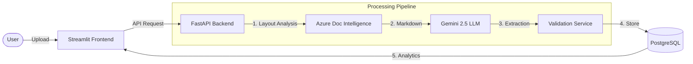

<a name="readme-top"></a>

<div align="center">

<!-- Header Image -->


<!-- Badges -->
<p align="center">
  <a href="https://github.com/GothiProCoder/OCR-System/actions">
    
  </a>
  <a href="https://github.com/GothiProCoder/OCR-System/blob/main/LICENSE">
    
  </a>
  <a href="https://www.python.org/">
    
  </a>
  <a href="https://fastapi.tiangolo.com/">
    
  </a>
  <a href="https://streamlit.io/">
    
  </a>
</p>

<p align="center">
  <strong>Effortless Data Extraction from Complex Forms using Azure AI & Google Gemini 2.5</strong>
  <br />
  <br />
  <a href="#demo">View Demo</a>
  ·
  <a href="https://github.com/GothiProCoder/OCR-System/issues">Report Bug</a>
  ·
  <a href="https://github.com/GothiProCoder/OCR-System/issues">Request Feature</a>
</p>
</div>

---

<details>
  <summary><strong>📖 Table of Contents</strong></summary>

  1. [About The Project](#-about-the-project)
  2. [Architecture](#-architecture)
  3. [Key Features](#-key-features)
  4. [Getting Started](#-getting-started)
     - [Prerequisites](#prerequisites)
     - [Docker Setup (Recommended)](#-docker-setup-recommended)
     - [Local Installation](#-local-installation-manual)
  5. [Usage Guide](#-usage-guide)
  6. [Tech Stack](#-tech-stack)
  7. [Configuration](#-configuration)
  8. [Roadmap](#-roadmap)
  9. [Contributing](#-contributing)
  10. [License](#-license)
  11. [Contact](#-contact)
</details>

---

## 🚀 About The Project

> **Transform unstructured documents into structured data in seconds.**

**Lumina OCR** (formerly FormExtract AI) is an enterprise-grade document processing system designed to solve the headache of manual data entry. By combining the layout-aware precision of **Azure Document Intelligence** with the reasoning capabilities of **Google Gemini 2.5 Flash Lite**, Lumina accurately extracts, validates, and structures data from invoices, medical forms, applications, and more.

### Why Lumina?
Most OCR tools just give you raw text. Lumina gives you **intelligence**:
*   **Understanding**: It knows the difference between an "Invoice Date" and a "Due Date".
*   **Correction**: It validates data types and confidence scores, flagging low-confidence fields for human review.
*   **Flexibility**: Works on PDFs, Images, and even handwritten forms.

<p align="right">(<a href="#readme-top">↑ top</a>)</p>

## 🎬 Demo

<div align="center">
  <!-- PLACEHOLDER FOR DEMO GIF -->
  <!-- Suggested: Record a 15s clip showing Upload -> Processing -> Review Page -->
  
</div>

<p align="right">(<a href="#readme-top">↑ top</a>)</p>

## 🏗 Architecture

Lumina utilizes a modern event-driven architecture orchestrated by **LangGraph**.



<p align="right">(<a href="#readme-top">↑ top</a>)</p>

## ✨ Key Features

*   **📄 Multi-Format Support**: Handles PDF, JPEG, PNG, and TIFF files seamlessly.
*   **🧠 GenAI Extraction**: Uses Gemini 2.5 to understand form context and extract structured JSON.
*   **✏️ Interactive Editor**: Review and correct extracted data with a side-by-side document viewer.
*   **📊 Confidence Scoring**: Color-coded confidence indicators (Green/Yellow/Red) guide your attention.
*   **🔌 API-First Design**: Fully documented REST API for integration into other workflows.
*   **📉 Analytics Dashboard**: Track processing volumes, success rates, and token usage.

<p align="right">(<a href="#readme-top">↑ top</a>)</p>

## 💻 Tech Stack

<div align="center">

<!-- Backend -->


<!-- Frontend -->


<!-- AI & Data -->


</div>

<p align="right">(<a href="#readme-top">↑ top</a>)</p>

## 🚀 Getting Started

### Prerequisites

*   **Docker Desktop** (Recommended) OR **Python 3.10+** & **PostgreSQL 16+**
*   **API Keys**:
    *   Google Cloud API Key (for Gemini)
    *   Azure Document Intelligence Endpoint & Key

---

### 🐳 Docker Setup (Recommended)

1.  **Clone the repository**
    ```bash
    git clone https://github.com/GothiProCoder/OCR-System.git
    cd OCR-System
    ```

2.  **Configure Environment**
    ```bash
    cp .env.example .env
    # Open .env and add your AZURE and GEMINI credentials
    ```

3.  **Launch Services**
    ```bash
    docker-compose up -d
    ```

4.  **Access Application**
    *   frontend: http://localhost:8501
    *   Backend API: http://localhost:8000/docs
    *   Database Admin: http://localhost:5050

---

### 🔧 Local Installation (Manual)

<details>
<summary>Click to expand local installation steps</summary>

1.  **Create Virtual Environment**
    ```bash
    python -m venv .venv
    # Windows
    .venv\Scripts\activate
    # Mac/Linux
    source .venv/bin/activate
    ```

2.  **Install Dependencies**
    ```bash
    pip install -r requirements.txt
    ```

3.  **Setup Database**
    Ensure PostgreSQL is running locally, then initialize the DB:
    ```bash
    python scripts/init_db.py
    ```

4.  **Run Backend** (Terminal 1)
    ```bash
    cd backend
    uvicorn main:app --reload
    ```

5.  **Run Frontend** (Terminal 2)
    ```bash
    cd frontend
    streamlit run app.py
    ```
</details>

<p align="right">(<a href="#readme-top">↑ top</a>)</p>

## 📖 Usage Guide

1.  **Upload**: Go to the **Upload Page**, drag & drop your PDF or Image.
2.  **Processing**: Watch the real-time status updates as the pipeline analyzes the document.
3.  **Review**: Automatically redirected to the **Review & Edit** interface.
    *   The document is displayed on the left (with bounding boxes).
    *   Extracted fields are on the right.
    *   Click any field to edit its value.
4.  **Export**: Once satisfied, click "Finalize" to lock the record and export to CSV/JSON.

<p align="right">(<a href="#readme-top">↑ top</a>)</p>

## ⚙️ Configuration

The system is highly configurable via `.env`. Key settings:

| Variable | Description | Default |
| :--- | :--- | :--- |
| `GEMINI_MODEL` | LLM Model Version | `gemini-2.5-flash-lite` |
| `OCR_INFERENCE_METHOD` | OCR Engine | `azure` (alternatives: `paddleocr`) |
| `PREPROCESSING_APPLY_DESKEW` | Auto-straighten images | `True` |
| `CONFIDENCE_HIGH_THRESHOLD` | Threshold for "Green" confidence | `0.85` |

<p align="right">(<a href="#readme-top">↑ top</a>)</p>

## 🗺 Roadmap

- [x] **Core Pipeline**: Azure OCR + Gemini Extraction
- [x] **UI**: Streamlit Dashboard & Editor
- [x] **Data**: PostgreSQL Schema & Versioning
- [ ] **Advanced**: Multi-page table extraction improvements
- [ ] **Auth**: User authentication & RBAC
- [ ] **Cloud**: Deploy to Azure Container Apps / AWS ECS

See the [open issues](https://github.com/GothiProCoder/OCR-System/issues) for a full list of proposed features.

<p align="right">(<a href="#readme-top">↑ top</a>)</p>

## 🤝 Contributing

Contributions are what make the open source community such an amazing place to learn, inspire, and create. Any contributions you make are **greatly appreciated**.

1.  Fork the Project
2.  Create your Feature Branch (`git checkout -b feature/AmazingFeature`)
3.  Commit your Changes (`git commit -m 'Add some AmazingFeature'`)
4.  Push to the Branch (`git push origin feature/AmazingFeature`)
5.  Open a Pull Request

<p align="right">(<a href="#readme-top">↑ top</a>)</p>

## 📄 License

Distributed under the MIT License. See `LICENSE` for more information.

<p align="right">(<a href="#readme-top">↑ top</a>)</p>

## 📧 Contact

**GothiProCoder** - [GitHub Profile](https://github.com/GothiProCoder)

Project Link: [https://github.com/GothiProCoder/OCR-System](https://github.com/GothiProCoder/OCR-System)

<p align="right">(<a href="#readme-top">↑ top</a>)</p>
